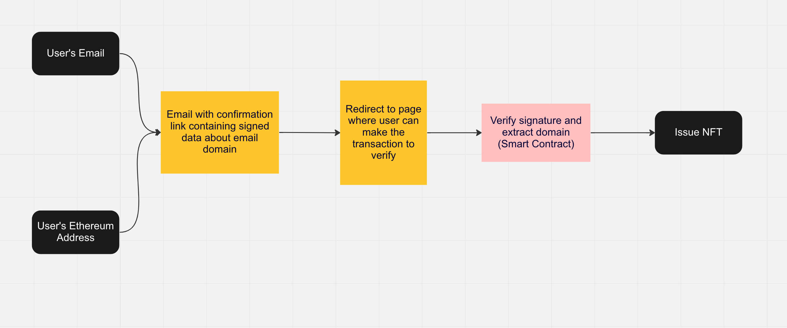

# Email Verification



# Steps

- User sees a page where they can enter their email address and ethereum address. [Assume email address is **shubham@dappcamp.xyz** and ethereum address is **0xABCD**]

- When user submits a request, on the backend we encrypt the user’s email domain and user’s ethereum address with our private key to generate a signature. In our case this is the data which is encrypted
    
    ```json
    {
    	"domain": "@dappcamp.xyz",
    	"ethereum_address": "0xABCD"
    }
    ```
    
- We then send the email to the user containing a confirmation link with signature. The confirmation link will look something like this - “https://ourwebsite.xyz?sig=0x1928589182091628”

- On clicking the confirmation link, the user is directed to a page where they submit a transaction with their wallet. The transaction will call a function on the smart contract passing signature as a parameter

- On the smart contract, we verify the following
    - The signature is a message signed by an approved address (we signed the message in step 2)
    - The msg.sender and the address in signature are same

- If all verifications pass, we mint an NFT containing the email domain and issue it to the sender of this transaction